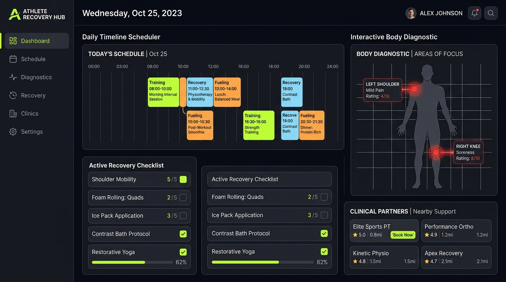
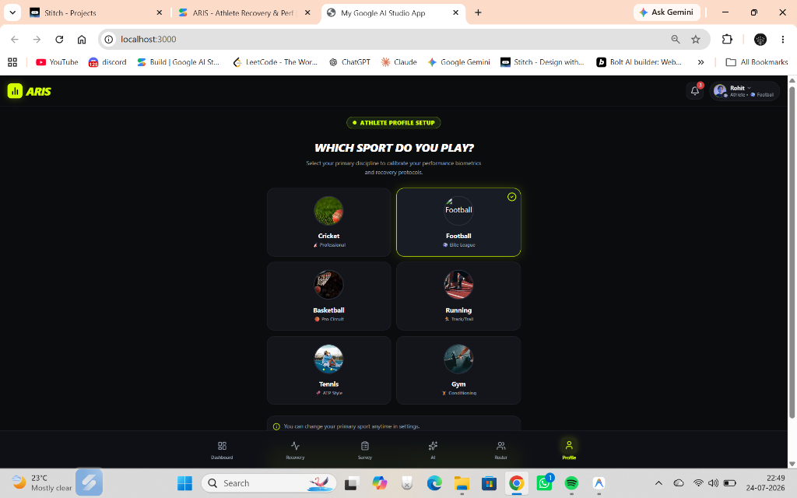

# ⚡ ARIS — Athlete Recovery & Performance Intelligence System

ARIS is an elite, real-time athletic performance intelligence platform. It features interactive injury diagnostics, biometric telemetry tracking, AI-powered recovery protocols, a team squad roster with injury risk flags, and clinical partner booking.

---

## 🚀 Key Features

*   **Interactive Injury Diagnostic Canvas**: A visual human silhouette overlay with dynamic injury hotspot markers (e.g., right hamstring strain risk, left quad tension).
*   **AI-Generated Recovery Protocols**: Custom pre-match warm-ups and post-match recovery drills generated dynamically using the **Google Gemini API** (`@google/genai`).
*   **Daily Timeline Planner**: A responsive schedule layout tracking fueling, training, and recovery blocks.
*   **Biometric Survey & Readiness Score**: Real-time evaluation of hydration, sleep quantity/quality, soreness, and heart rate zones to calculate daily readiness metrics.
*   **Squad Roster & Coach KPIs**: A coach-level view showing team readiness, critical risk flags, and average HRV baselines.
*   **Clinical Partner Booking**: Direct appointment scheduling with specialized sports physiotherapy clinics.

---

## 🛠️ Technology Stack

*   **Frontend**: React (v19), TypeScript, Vite
*   **Styling**: Tailwind CSS (v4), Motion (for sleek animations)
*   **Charts**: Recharts (for biometric visualization)
*   **Icons**: Lucide React
*   **Backend Server**: Express (Node.js) with real-time JSON mock database
*   **AI Integration**: Google Gen AI SDK (`@google/genai` utilizing `gemini-2.5-flash` model)

---

## 📁 Project Structure

```
aris/
├── src/
│   ├── components/            # React UI components
│   │   ├── AIProtocolsView.tsx
│   │   ├── AuthModal.tsx
│   │   ├── BookingModal.tsx
│   │   ├── BottomNav.tsx
│   │   ├── DashboardView.tsx
│   │   ├── Header.tsx
│   │   ├── ProfileView.tsx
│   │   ├── RosterView.tsx
│   │   └── SurveyView.tsx
│   ├── server/
│   │   └── db.ts             # Mock JSON database engine
│   ├── types.ts              # TypeScript models & interfaces
│   ├── main.tsx              # React client entrypoint
│   └── App.tsx               # Main application container
├── server.ts                 # Express API server & Vite dev middleware
├── package.json              # Dependencies and run scripts
├── tsconfig.json             # TypeScript settings
└── vite.config.ts            # Vite bundler configuration
```

---

## ⚙️ Installation & Setup

### 1. Prerequisites
Ensure you have **Node.js** (v18+) installed.

### 2. Clone and Install Dependencies
```bash
npm install
```

### 3. Environment Configuration
Create a `.env` file in the root directory and add your Google Gemini API key:
```env
GEMINI_API_KEY=your_gemini_api_key_here
```

### 4. Run Locally (Development Mode)
```bash
npm run dev
```
The server will boot up and be accessible at:
*   Local: [http://localhost:3000](http://localhost:3000)

---

## 📸 Screenshots

### Athlete Dashboard & Injury Diagnostics


### Biometric survey & Sport Customizer


---

## 🤝 Contributing
For updates, modifications, or feature proposals, please submit a pull request or open an issue.